# IT3091 Machine Learning Group Assignment - Initial Plan

## 1. Project overview and group identity

- **Module:** IT3091 Machine Learning
- **Group:** 2026-AI-46
- **Lab group:** Y3.S1.WD.AI.0101
- **Track:** Guided Data Track

This plan is the group's Initial Submission. Member names must be confirmed before submission (see section 15).

### How the work is split

The project runs in three phases so that the model comparison stays valid:

1. **Shared foundation - built once, by the project lead.** Data acquisition, EDA, cleaning, feature engineering and the preprocessing pipeline are built **once** and then frozen: a fixed seeded train/test split, the prepared feature matrix, the cross-validation fold definition and the metric set. Nothing in this foundation changes after it is locked.
2. **One model per member (parallel).** Each member loads the *same* frozen split and pipeline and owns one model end to end: hyperparameter tuning inside the shared CV folds, metrics, calibration, feature importance, error analysis and that model's write-up.
3. **Comparison and recommendation.** The per-model results are assembled into one comparison table (valid because every model saw identical data), the recommended model is chosen, and the recommendation, limitations and reproducibility check are completed.

**Change of plan, 2026-09-03.** Phase 1 was originally written as a whole-team artefact signed off by all four members. In practice the project lead is building the entire shared foundation alone - data acquisition, EDA, data quality, leakage analysis, cleaning, feature engineering, the pipeline, the split, the CV folds and the metric harness - because the schedule was compressed from seven weeks to three (section 13) and waiting on group sign-off at each step is not affordable. Every decision is still written down with the evidence behind it in `reports/eda_insight_log.md` and the decision log, so the group can **review** the foundation rather than re-derive it. This is recorded here rather than left implicit, because section 11 commits us to an honest statement of who did what.

### Member responsibilities

| Member | Responsibility | Model owned |
| --- | --- | --- |
| M1 (project lead) | **The entire shared foundation**: dataset acquisition and fingerprint, data dictionary, EDA and insight log, data-quality and leakage reasoning, cleaning, feature engineering, the `Pipeline`/`ColumnTransformer`, the split, the CV protocol and the metric harness. Plus coordination: workflow diagram, decision log, final comparison table, report assembly, video | Logistic Regression (baseline) |
| M2 | One model end to end on the frozen foundation, plus that model's report subsection | Decision Tree |
| M3 | One model end to end on the frozen foundation, plus that model's report subsection | Random Forest |
| M4 | One model end to end on the frozen foundation, plus that model's report subsection | Gradient Boosting (XGBoost) |

Names for M1-M4 are TODO and must be confirmed before the Initial Submission.

**Contingency.** If a member has not delivered their model by the end of Week 2 (section 13), the lead runs that model from the frozen foundation instead. This is cheap by design: once the pipeline, the folds and the metric harness exist, adding a model is a small and mechanical amount of code, which is exactly why the foundation is built first. If this happens, the report's contribution statement must say so plainly - claiming work that was not done is a worse outcome than an uneven contribution table. The optional k-NN model is dropped first if time is short (see the cut list in section 13).

## 2. Track and decision lens

Group 2026-AI-46 maps to code **6** (the final digit of its group number). The Guided Data Track assigns code 6 to **Tourism & Hospitality**, using the **Hotel Booking Demand** dataset. We will use this controlled track because it directly fits the assignment descriptor and does not require prior Industry Explorer approval.

Our primary lens is **cancellation risk**: predicting whether a booking will be cancelled. This is a coherent, actionable decision problem for a hotel chain seeking better booking reliability, revenue planning and customer management. A secondary segmentation analysis is optional only: it may profile high-risk booking groups after the prediction work, and will be retained only if it makes the recommendation clearer.

## 3. Problem-framing canvas

| Element | Decision |
| --- | --- |
| Stakeholder | Revenue and operations manager of a hotel chain |
| Decision need | Set appropriate deposit, overbooking and re-confirmation actions before arrival |
| Unit of analysis | One hotel booking |
| ML task | Supervised binary classification |
| Target | `is_canceled` (1 = cancelled, 0 = not cancelled) |
| Output | Cancellation probability, classification at a documented operating threshold, and key drivers |
| Value | Better demand forecasts, reduced empty-room losses and targeted customer outreach |

The model will support rather than automate decisions. Managers should use a risk score alongside capacity, policy and customer-service constraints.

## 4. Data understanding and EDA plan

The Hotel Booking Demand dataset (Antonio, Almeida and Nunes, 2019) contains about 119,390 bookings from City Hotel and Resort Hotel, with 32 columns. We will document the source URL, licence or access terms, download date and SHA-256 fingerprint of the exact CSV used.

Five published Kaggle notebooks on this same dataset were read on 2026-09-03 as a structural benchmark for this stage; they are listed, with what we took and what we rejected, in section 16.

Before modelling, we will produce a data dictionary and inspect:

- row meaning, variable types, unique values and distributions;
- cancellation rate overall and by hotel type, market segment, lead time and deposit type;
- missingness, including the few missing `children` values, missing `country`, and heavily missing ID-like `agent` and `company` fields;
- invalid or implausible rows, including zero guests (`adults + children + babies = 0`), anomalous meal values and extreme `adr` values;
- duplicates and the relationship between features and the target.

## 5. Leakage controls

The following outcome-revealing columns will **never** be model features:

- `reservation_status`
- `reservation_status_date`

Both are determined at or after the final reservation outcome and would make validation misleading. We will also document a conservative “prediction-time” feature set. `assigned_room_type`, `booking_changes`, `days_in_waiting_list` and `required_car_parking_spaces` may reflect information that arrives after initial booking; they will be excluded from the main model unless their availability at the intended decision time is verified. If useful, they can be evaluated separately as a clearly labelled later-stage sensitivity analysis.

`required_car_parking_spaces` was added to that list in Week 2 on EDA evidence: none of the 7,416 bookings that request parking was ever cancelled, a perfect separation that indicates the field is populated at check-in rather than at booking. The engineered `room_changed` flag (reserved room ≠ assigned room) was added for the same reason: a room is only re-assigned to a guest who actually arrived. Both findings, with the crosstabs behind them, are in `reports/eda_insight_log.md` (findings L2 and L3) and in the decision log entry of 2026-09-03.

All imputation, encoding, scaling, outlier treatment and feature selection will be fitted within training folds only, using a scikit-learn `Pipeline` and `ColumnTransformer`.

## 6. Preprocessing and feature engineering

This pipeline is built once by the whole team (M3 leads) and then **frozen** as the shared foundation described in section 1: every model in section 7 is trained and compared on the identical output of this pipeline, the same seeded train/test split and the same cross-validation folds.

| Issue | Planned treatment |
| --- | --- |
| Missing values | **Settled in Week 2 on EDA evidence.** `company` (94.3% missing) becomes the `booked_by_company` flag and the ID is dropped; `agent` (13.7% missing) becomes `booked_with_agent` plus an explicit `"0"` category; `country` (0.41%) gets an explicit `Unknown` category rather than mode-filling; `children` (4 rows) is filled with 0. No column needs median imputation, so none is applied |
| Outliers | **Settled in Week 2.** Only two demonstrable errors removed (`adr = -6.38` and a single `adr = 5400` against a next-highest 510). No blanket IQR removal — long lead times are real and carry the strongest signal. Heavy tails handled by scaling for the linear model only |
| Duplicates | **Settled in Week 2.** 31,994 rows are identical on all 32 columns, 32,252 once the leakage columns are dropped. Removed as the last cleaning step, because with no booking ID they let a classifier memorise across the train/test split. Documented cost: the measured cancellation rate falls from 37.0% to 27.3% |
| Categorical variables | One-hot encode low-cardinality fields; compare a leakage-safe encoded approach for high-cardinality `country` only when justified |
| Scaling | Scale numeric columns for Logistic Regression and any distance-based model; tree models use unscaled compatible inputs |
| Class balance | The positive class is 37.0% on the raw data (business baseline) and **27.3% after deduplication** (modelling baseline). Still mild, so stratification, class weights and threshold tuning; do not apply SMOTE by default |

Candidate engineered features include total guests, total special requests, lead-time bands, booking-date seasonality and the difference between reserved and assigned room types only in the later-stage sensitivity analysis.

## 7. Model and data-mining strategy

We will first establish a simple, reproducible baseline and then compare at least three alternatives using the same split and cross-validation protocol. Each model is **owned by one member** (see section 1) and trained on the frozen shared foundation from section 6, so every model is judged on identical data, identical folds and identical metrics.

| Model | Role and justification |
| --- | --- |
| Logistic Regression | Interpretable baseline; produces probabilities and tests whether linear effects are sufficient |
| Decision Tree | Transparent non-linear benchmark, but likely prone to overfitting without pruning |
| Random Forest | Captures interactions and non-linearities robustly; provides feature-importance evidence |
| Gradient Boosting (XGBoost or LightGBM, subject to environment approval) | Strong tabular-data candidate; tune carefully and compare its added complexity against benefit |
| Optional k-NN | Include only if preprocessing and runtime make it a meaningful distance-based comparison |

Each model owner follows the same protocol: a small pre-specified hyperparameter search run **inside** the cross-validation folds, then a single fit on the full training set, then one scored pass on the held-out test set. Each owner produces their model's CV scores, confusion matrix, calibration curve, feature-importance or coefficient evidence and a short error analysis, and drafts that model's subsection of the comparison. M1 then assembles the combined comparison table. Model selection will balance predictive quality, calibration, interpretability, training cost and stakeholder usefulness rather than selecting solely by accuracy.

## 8. Evaluation and validation

1. Hold out a stratified test set before model selection.
2. Use stratified k-fold cross-validation on the remaining training data for tuning and comparison.
3. Select an operating threshold using training/CV results and document the business trade-off before applying it once to the test set.

Primary measures will be **PR-AUC**, **F1** and recall for cancelled bookings at the selected threshold. Secondary measures are ROC-AUC, precision, calibration, confusion matrix and class-wise error analysis. We will explicitly compare the cost of a missed cancellation (potential empty room/poor forecast) against a false alarm (unnecessary outreach or restrictive policy). Accuracy will be reported but never used as the only success criterion.

## 9. Workflow and decision log

```mermaid
flowchart LR
    A[Business problem and stakeholder] --> B[Choose guided track and cancellation-risk lens]
    B --> C[Data acquisition, dictionary and EDA]
    C --> D[Define prediction-time features and remove leakage]
    D --> E[Pipeline preprocessing and feature engineering]
    E --> F[Freeze shared foundation: split, pipeline, CV folds, metrics]
    F --> G[One model per member, trained on the frozen foundation]
    G --> H[Combined comparison, threshold selection, held-out test]
    H --> I[Recommendation, limitations and demo]
```



At every arrow, the team will keep a dated decision-log entry recording the options considered, evidence, chosen action and expected impact. EDA insights and preprocessing decisions will be recorded separately so the final report can trace recommendations back to evidence.

## 10. Planned recommendation and limitations

A useful final output will rank bookings by cancellation risk and explain broad, evidence-supported drivers. It could guide a re-confirmation campaign for high-risk bookings and inform deposit or overbooking policy, subject to manager approval and fairness review.

Limitations to state honestly include historical data from two hotels (2015-2017), possible concept drift, limited information about price elasticity and customer intent, and the risk that operational variables are unavailable at the decision time. Predictions are not grounds for unfair treatment of individual customers.

## 11. Reproducibility and AI-use transparency

- Keep a **numbered, runnable notebook sequence** (`01_`, `02_`, `03_*`) with fixed random seeds and a documented execution order. Each notebook reads only files the previous one wrote, so the chain can be re-run from a clean clone. This replaces the earlier "one runnable notebook" wording, which does not survive four people working in parallel.
- Record dataset source, version/download date and SHA-256 fingerprint.
- Keep dependency versions in `requirements.txt`.
- Store raw data outside version control when it is large or licensing requires it.
- Declare AI assistance honestly, including what it helped draft or explain, and independently verify all analysis and citations.
- Acknowledge the published notebooks consulted as a structural benchmark, and say which of our decisions deliberately depart from them (section 16).
- State honestly who did what, including where the planned split of work did not hold (section 1).

## 12. Proposed repository structure

```text
data/
  raw/            # hotel_bookings.csv (untracked) + SOURCE.md fingerprint
  processed/      # hotel_bookings_clean.csv (untracked, rebuilt by notebook 01)
notebooks/
  01_eda_and_cleaning.ipynb      # DONE - understanding, EDA, quality, leakage, cleaning, features
  02_pipeline_and_split.ipynb    # NEXT - split, ColumnTransformer, CV folds, metric harness
  03_*.ipynb                     # one per model, all on the frozen foundation
reports/
  data_dictionary.csv            # generated by notebook 01
  feature_roles.csv              # the frozen feature contract notebook 02 reads
  eda_insight_log.md             # generated by notebook 01
Docs/             # provided assignment documents
knowledge/        # project knowledge/index files
plan.md
requirements.txt
```

## 13. Three-week timeline

The original seven-week plan was compressed on **2026-09-03** to the three weeks actually available.
Dates below assume a final deadline of **2026-09-24** and must be confirmed against the module handbook.

### Status at 2026-09-03

| Stage | State | Artefact |
| --- | --- | --- |
| Problem framing, track, lens, target | done | sections 2-3 |
| Data acquisition, licence and SHA-256 fingerprint | done | `data/raw/SOURCE.md` |
| Data dictionary with a role for all 32 columns | done | `reports/data_dictionary.csv` |
| EDA: 16 charts, each with a written reading, plus a ranked driver table | done | `notebooks/01_eda_and_cleaning.ipynb` section 8 |
| Data quality: missing, duplicates, impossible rows, outliers | done | insight log, findings 1-9 |
| Leakage analysis and exclusion list | done | insight log, findings L1-L4; section 5 |
| Cleaning and feature engineering (36 model features) | done | `data/processed/hotel_bookings_clean.csv` |
| Frozen feature contract | done | `reports/feature_roles.csv` |
| Split, pipeline, CV folds, metric harness, imbalance handling | **next** | `notebooks/02_pipeline_and_split.ipynb` |
| Four models tuned inside the shared folds | not started | `notebooks/03_*.ipynb` |
| Comparison, threshold selection, single held-out test pass | not started | - |
| Recommendation, limitations, report, video | not started | - |

### Week 1 - 2026-09-03 to 2026-09-10 - lead, alone

| # | Task | State |
| --- | --- | --- |
| 1.1 | Notebook 01: data understanding, EDA, quality, leakage, cleaning, feature engineering, frozen contract | done 2026-09-03 |
| 1.2 | Notebook 02: stratified train/test split, held out before any model selection, `random_state=42` | to do |
| 1.3 | Notebook 02: one `ColumnTransformer` - scaling for the numeric block, one-hot for the low-cardinality categoricals, a leakage-safe encoder for `country` (178 levels) and `agent` (334 levels), all fitted **inside** the folds | to do |
| 1.4 | Notebook 02: frozen stratified k-fold definition, shared by every model | to do |
| 1.5 | Notebook 02: class-imbalance handling - stratification, `class_weight='balanced'`, threshold tuning on CV; **no SMOTE**, because 27.3% positive is mild | to do |
| 1.6 | Notebook 02: metric harness - PR-AUC, F1 and recall on the cancelled class as primary; ROC-AUC, precision, accuracy, confusion matrix and calibration as secondary | to do |
| 1.7 | Hand the frozen foundation to M2-M4 with a one-page "how to add your model" note | to do |

### Week 2 - 2026-09-11 to 2026-09-17 - parallel where possible

| # | Task | Owner |
| --- | --- | --- |
| 2.1 | Logistic Regression: tuned in-fold, coefficients read as evidence | M1 |
| 2.2 | Decision Tree: tuned in-fold, pruning justified | M2 |
| 2.3 | Random Forest: tuned in-fold, feature importances | M3 |
| 2.4 | Gradient Boosting (XGBoost): tuned in-fold | M4 |
| 2.5 | Per model: CV scores, confusion matrix, calibration curve, feature-importance or coefficient evidence, short error analysis | each owner |
| 2.6 | Assemble the combined comparison table | M1 |
| 2.7 | Contingency check: any model not delivered by 2026-09-17 is run by the lead | M1 |

### Week 3 - 2026-09-18 to 2026-09-24 - team

| # | Task |
| --- | --- |
| 3.1 | Choose the recommended model on predictive quality, calibration, interpretability, training cost and stakeholder usefulness - not on accuracy alone |
| 3.2 | Select the operating threshold from CV, document the business trade-off, then take **one** scored pass on the held-out test set |
| 3.3 | Recommendation, limitations, and the fairness note on `previous_cancellations` |
| 3.4 | Optional: the clearly labelled post-booking sensitivity analysis (what the excluded columns would have added) |
| 3.5 | Report assembly, decision log, AI-use declaration, reference acknowledgement (section 16) |
| 3.6 | Reproducibility check: clean clone, `pip install -r requirements.txt`, run the notebooks in order, confirm the numbers match |
| 3.7 | Record the three-minute YouTube demonstration and submit |

### Cut list if time runs short

Drop in this order, and state in the report what was dropped and why:

1. The optional k-NN model.
2. The post-booking sensitivity analysis (task 3.4).
3. Calibration curves for the models that were not selected.

**Never cut:** the single held-out test pass, the leakage controls, and the reproducibility re-run. Those three are what separate a defensible result from a number nobody can trust.

## 14. Deliverables checklist mapped to rubric

| Rubric criterion | Marks | Evidence planned |
| --- | ---: | --- |
| Problem framing and lens/task | 5 | Canvas, primary lens, target/output and stakeholder rationale |
| Workflow diagram and decision log | 10 | Mermaid workflow and dated decision log |
| Data understanding, EDA and quality | 10 | Dictionary, EDA insight log and quality findings |
| Preprocessing and feature engineering | 15 | Pipeline, feature log and leakage controls |
| Model strategy and comparison | 20 | Baseline plus at least three justified alternatives, one owned by each member, all trained on the frozen shared foundation |
| Evaluation and critical judgement | 20 | Stratified validation, PR-AUC/F1/recall, calibration and error analysis |
| Recommendation, limitations and value | 10 | Actionable, evidence-based recommendation and limitations |
| Reproducibility, documentation and AI-use | 10 | Runnable notebook, fingerprint, requirements and honest declaration |

## 15. Open questions for the team or lecturer

1. Confirm the group-number-to-code mapping and Guided Track allocation with the lecturer.
2. Confirm the authoritative dataset source/URL and citation format.
3. Decide whether City Hotel and Resort Hotel are modelled jointly (with `hotel` as a feature) or separately after EDA; joint modelling is the initial default.
4. Confirm member names, and confirm that M2-M4 accept sole ownership of one model each (section 1). The shared foundation is no longer shared work; the contribution statement must reflect that.
5. Confirm the actual submission deadline. Section 13 assumes 2026-09-24.
6. Confirm which prediction time is expected by the stakeholder, since that governs the borderline operational features.

## 16. Reference notebooks consulted

Five published Kaggle notebooks analysing the same Hotel Booking Demand dataset were read on
**2026-09-03**, before notebook 01 was written, and used as a structural benchmark: they establish what a
competent EDA on this dataset looks like, which columns other analysts keep or drop, and which engineered
features are conventional. They are listed here for transparency, and because several of our decisions are
**deliberate departures** from them.

| Ref | Notebook | Author | What we adopted |
| --- | --- | --- | --- |
| R1 | [Hotel Booking Cancellation Prediction \| EDA + 6 ML](https://www.kaggle.com/code/dalileholadzadeh/hotel-booking-cancellation-prediction-eda-6-ml) | Dalileh Oladzadeh | The `value_counts()` sweep across every categorical, `describe().T`, duplicate removal, and the IQR outlier check on `lead_time` |
| R2 | [Hotel Cancellation Prediction using ANN](https://www.kaggle.com/code/aamir5659/hotel-cancellation-prediction-using-ann) | Aamir | Zero-guest row removal, one justified rule per missing-value column, and frequency encoding as the treatment for high-cardinality `country` |
| R3 | [HotelBookingCancellationAnalysis-V1](https://www.kaggle.com/code/kushal1147/hotelbookingcancellationanalysis-v1) | Kushal | The written data dictionary, cardinality-driven encoding planning, and most of the engineered feature list |
| R4 | [Hotel Booking](https://www.kaggle.com/code/hazemalanany/hotel-booking) | Hazem Alanany | The chart set: cancellation pie, ordered-month countplot, top-10 origin countries, ADR-by-month per hotel, KDE of lead time by class, special-requests-versus-rate |
| R5 | [Hotel Booking Cancellation Analysis \| Python](https://www.kaggle.com/code/ahmedbaqa/hotel-booking-cancellation-analysis-python) | Ahmed Baqa | The `head`/`shape`/`info`/`describe`/`isna` opening sequence, percentage labels on every bar, lead-time bands with a rate per band, and the derived `has_previous_cancellation` flag |

### Where we deliberately differ

| # | What they do | What we do instead | Why |
| --- | --- | --- | --- |
| D1 | R1, R3 and R2 fill missing `country` with the mode, `PRT` | Explicit `Unknown` category | Portugal is already 40.7% of the raw data and the highest-cancelling country at 56.6%; mode-filling inflates the single strongest country signal |
| D2 | R1 drops `agent` and `company` outright; R3 drops `company` | `booked_with_agent` and `booked_by_company` flags, and `agent` kept as an explicit category | Missing there *means* "no agent / no company" - that is information, not absence |
| D3 | R2 and R3 cut the top 0.1% of `adr` (about 87 rows) | Remove only the two rows we can show are errors (`adr = -6.38`, and `adr = 5400` against a next-highest 510) | Blanket quantile trimming deletes real bookings; only demonstrable errors are removed |
| D4 | All five use `required_car_parking_spaces`, and R2/R3 also use `room_changed`, as model features | Both excluded as **post-booking** | 7,416 parking requests, zero ever cancelled; a room is only re-assigned to a guest who arrived. Both are populated at check-in, after the cancellation decision |
| D5 | All five encode, scale and split in the same notebook as the EDA | Encoding, scaling and imputation are deferred to notebook 02 and fitted **inside** the CV folds | Fitting them on the full dataset leaks the test set into the training statistics and inflates every reported score |
| D6 | R5 builds a `high_risk_profile` rule that is 100% cancelled over 2,405 rows | Not used | It is a hand-built interaction, not a finding; the tree models discover it on their own, and presenting it as a result would overstate what the data shows |
| D7 | R2 drops `arrival_date_day_of_month` as noise | Kept | It costs one column, and the trees can ignore it; dropping it without evidence is an unjustified decision |

### Acknowledgement of influence

No cells were copied verbatim from these notebooks. Several **engineered-feature definitions and names**
follow R2 and R3 directly - `total_nights`, `total_guests`, `is_family`, `room_changed`,
`total_previous_bookings`, `prev_cancel_ratio`, `long_lead_time` - and the lead-time band edges follow R5
so that our rates in section 8.2 of notebook 01 are directly comparable to a published result. These are
acknowledged here rather than presented as original work.

R1 also supplies a useful negative result that we cite as evidence in the report: its Random Forest scores
**72.8% accuracy while recalling 57 of 4,805 cancellations (recall 0.012)**. That is a model which looks
respectable on an accuracy column and is worthless to a revenue manager, and it is the concrete
justification for our metric choice in section 8 and our class-imbalance handling in section 6.
