# IT3091 Machine Learning Group Assignment - Initial Plan

## 1. Project overview and group identity

- **Module:** IT3091 Machine Learning
- **Group:** 2026-AI-46
- **Lab group:** Y3.S1.WD.AI.0101
- **Track:** Guided Data Track

This plan is the group's Initial Submission. Work is currently coordinated by the project lead; member names must be confirmed before submission (see section 15).

### How the team works

The project runs in three phases so that the model comparison stays valid:

1. **Shared foundation (whole team).** Data acquisition, EDA and the preprocessing pipeline are built **once**, as agreed team artefacts, then frozen: a fixed seeded train/test split, the prepared feature matrix, the cross-validation fold definition and the metric set. Nothing in this foundation changes after it is locked. "Whole team" means every decision is reviewed and signed off by all members in the decision log; individual sections are still drafted by their owner.
2. **One model per member (parallel).** Each member loads the *same* frozen split and pipeline and owns one model end to end: hyperparameter tuning inside the shared CV folds, metrics, calibration, feature importance, error analysis and that model's write-up.
3. **Comparison and recommendation (whole team).** The per-model results are assembled into one comparison table (valid because every model saw identical data), the recommended model is chosen, and the recommendation, limitations and reproducibility check are completed.

### Member responsibilities

Each member has a **primary responsibility** (a pipeline stage they lead in phases 1 and 3) and a **secondary responsibility** (one model they own in phase 2).

| Member | Primary responsibility (pipeline stage) | Secondary responsibility (model owned) |
| --- | --- | --- |
| M1 | Coordination: problem framing, workflow diagram, decision log, final comparison table, report assembly, video | Logistic Regression (baseline) |
| M2 | Data & EDA: dataset acquisition and fingerprint, data dictionary, EDA insight log, data-quality reasoning | Decision Tree |
| M3 | Preprocessing & features: the shared `Pipeline`/`ColumnTransformer`, feature log, leakage exclusion list | Random Forest |
| M4 | Evaluation & reproducibility: metric harness, CV protocol, calibration/error-analysis templates, runnable notebook, `requirements.txt`, AI-use declaration | Gradient Boosting (XGBoost or LightGBM) |

Names for M1–M4 are TODO and must be confirmed before the Initial Submission. If a fifth model (k-NN) is added, it is co-owned by whichever member finishes their primary stage first.

## 2. Track and decision lens

Group 2026-AI-46 maps to code **6** (the final digit of its group number). The Guided Data Track assigns code 6 to **Tourism & Hospitality**, using the **Hotel Booking Demand** dataset. We will use this controlled track because it directly fits the assignment descriptor and does not require prior Industry Explorer approval.

Our primary lens is **cancellation risk**: predicting whether a booking will be cancelled. This is a coherent, actionable decision problem for a hotel chain seeking better booking reliability, revenue planning and customer management. A secondary segmentation analysis is optional only: it may profile high-risk booking groups after the prediction work, and will be retained only if it makes the recommendation clearer.

## 3. Problem-framing canvas

| Element | Decision |
| --- | --- |
| Stakeholder | Revenue and operations manager of a hotel chain |
| Decision need | Set appropriate deposit, overbooking and re-confirmation actions before arrival |
| Unit of analysis | One hotel booking |
| ML task | Supervised binary classification |
| Target | `is_canceled` (1 = cancelled, 0 = not cancelled) |
| Output | Cancellation probability, classification at a documented operating threshold, and key drivers |
| Value | Better demand forecasts, reduced empty-room losses and targeted customer outreach |

The model will support rather than automate decisions. Managers should use a risk score alongside capacity, policy and customer-service constraints.

## 4. Data understanding and EDA plan

The Hotel Booking Demand dataset (Antonio, Almeida and Nunes, 2019) contains about 119,390 bookings from City Hotel and Resort Hotel, with 32 columns. We will document the source URL, licence or access terms, download date and SHA-256 fingerprint of the exact CSV used.

Before modelling, we will produce a data dictionary and inspect:

- row meaning, variable types, unique values and distributions;
- cancellation rate overall and by hotel type, market segment, lead time and deposit type;
- missingness, including the few missing `children` values, missing `country`, and heavily missing ID-like `agent` and `company` fields;
- invalid or implausible rows, including zero guests (`adults + children + babies = 0`), anomalous meal values and extreme `adr` values;
- duplicates and the relationship between features and the target.

## 5. Leakage controls

The following outcome-revealing columns will **never** be model features:

- `reservation_status`
- `reservation_status_date`

Both are determined at or after the final reservation outcome and would make validation misleading. We will also document a conservative “prediction-time” feature set. `assigned_room_type`, `booking_changes` and `days_in_waiting_list` may reflect information that arrives after initial booking; they will be excluded from the main model unless their availability at the intended decision time is verified. If useful, they can be evaluated separately as a clearly labelled later-stage sensitivity analysis.

All imputation, encoding, scaling, outlier treatment and feature selection will be fitted within training folds only, using a scikit-learn `Pipeline` and `ColumnTransformer`.

## 6. Preprocessing and feature engineering

This pipeline is built once by the whole team (M3 leads) and then **frozen** as the shared foundation described in section 1: every model in section 7 is trained and compared on the identical output of this pipeline, the same seeded train/test split and the same cross-validation folds.

| Issue | Planned treatment |
| --- | --- |
| Missing values | Median imputation for suitable numeric fields; most-frequent or explicit `Unknown` category for categoricals; assess whether `agent`/`company` should be dropped or treated as categorical IDs |
| Outliers | Inspect `adr` and `lead_time`; correct only demonstrable data errors, otherwise use robust transformations/capping justified by EDA and report their impact |
| Duplicates | Count and investigate duplicates before deciding whether removal is appropriate |
| Categorical variables | One-hot encode low-cardinality fields; compare a leakage-safe encoded approach for high-cardinality `country` only when justified |
| Scaling | Scale numeric columns for Logistic Regression and any distance-based model; tree models use unscaled compatible inputs |
| Class balance | The positive class is approximately 37%, so begin with stratification, class weights and threshold tuning; do not apply SMOTE by default |

Candidate engineered features include total guests, total special requests, lead-time bands, booking-date seasonality and the difference between reserved and assigned room types only in the later-stage sensitivity analysis.

## 7. Model and data-mining strategy

We will first establish a simple, reproducible baseline and then compare at least three alternatives using the same split and cross-validation protocol. Each model is **owned by one member** (see section 1) and trained on the frozen shared foundation from section 6, so every model is judged on identical data, identical folds and identical metrics.

| Model | Role and justification |
| --- | --- |
| Logistic Regression | Interpretable baseline; produces probabilities and tests whether linear effects are sufficient |
| Decision Tree | Transparent non-linear benchmark, but likely prone to overfitting without pruning |
| Random Forest | Captures interactions and non-linearities robustly; provides feature-importance evidence |
| Gradient Boosting (XGBoost or LightGBM, subject to environment approval) | Strong tabular-data candidate; tune carefully and compare its added complexity against benefit |
| Optional k-NN | Include only if preprocessing and runtime make it a meaningful distance-based comparison |

Each model owner follows the same protocol: a small pre-specified hyperparameter search run **inside** the cross-validation folds, then a single fit on the full training set, then one scored pass on the held-out test set. Each owner produces their model's CV scores, confusion matrix, calibration curve, feature-importance or coefficient evidence and a short error analysis, and drafts that model's subsection of the comparison. M1 then assembles the combined comparison table. Model selection will balance predictive quality, calibration, interpretability, training cost and stakeholder usefulness rather than selecting solely by accuracy.

## 8. Evaluation and validation

1. Hold out a stratified test set before model selection.
2. Use stratified k-fold cross-validation on the remaining training data for tuning and comparison.
3. Select an operating threshold using training/CV results and document the business trade-off before applying it once to the test set.

Primary measures will be **PR-AUC**, **F1** and recall for cancelled bookings at the selected threshold. Secondary measures are ROC-AUC, precision, calibration, confusion matrix and class-wise error analysis. We will explicitly compare the cost of a missed cancellation (potential empty room/poor forecast) against a false alarm (unnecessary outreach or restrictive policy). Accuracy will be reported but never used as the only success criterion.

## 9. Workflow and decision log

```mermaid
flowchart LR
    A[Business problem and stakeholder] --> B[Choose guided track and cancellation-risk lens]
    B --> C[Data acquisition, dictionary and EDA]
    C --> D[Define prediction-time features and remove leakage]
    D --> E[Pipeline preprocessing and feature engineering]
    E --> F[Freeze shared foundation: split, pipeline, CV folds, metrics]
    F --> G[One model per member, trained on the frozen foundation]
    G --> H[Combined comparison, threshold selection, held-out test]
    H --> I[Recommendation, limitations and demo]
```



At every arrow, the team will keep a dated decision-log entry recording the options considered, evidence, chosen action and expected impact. EDA insights and preprocessing decisions will be recorded separately so the final report can trace recommendations back to evidence.

## 10. Planned recommendation and limitations

A useful final output will rank bookings by cancellation risk and explain broad, evidence-supported drivers. It could guide a re-confirmation campaign for high-risk bookings and inform deposit or overbooking policy, subject to manager approval and fairness review.

Limitations to state honestly include historical data from two hotels (2015-2017), possible concept drift, limited information about price elasticity and customer intent, and the risk that operational variables are unavailable at the decision time. Predictions are not grounds for unfair treatment of individual customers.

## 11. Reproducibility and AI-use transparency

- Keep one runnable notebook with fixed random seeds and clear execution order.
- Record dataset source, version/download date and SHA-256 fingerprint.
- Keep dependency versions in `requirements.txt`.
- Store raw data outside version control when it is large or licensing requires it.
- Declare AI assistance honestly, including what it helped draft or explain, and independently verify all analysis and citations.

## 12. Proposed repository structure

```text
data/             # raw (normally untracked) and processed data
notebooks/        # reproducible analysis notebook
src/              # reusable preprocessing/modelling helpers
reports/          # figures, decision logs and final artefacts
Docs/             # provided assignment documents
knowledge/        # project knowledge/index files
plan.md
requirements.txt
```

## 13. Seven-week timeline

| Week | Milestone |
| --- | --- |
| 1 | Confirm track, lens, task/output, member responsibilities and initial plan |
| 2 | **Team:** acquire/fingerprint data; data dictionary, EDA and insight log (M2 leads) |
| 3 | **Team:** leakage decision, preprocessing pipeline and feature log; freeze the shared foundation (M3 leads; M4 sets up the metric/CV harness) |
| 4 | **Parallel:** each member tunes and cross-validates their own model on the frozen foundation |
| 5 | **Parallel:** each member finishes calibration, error analysis and their model subsection; M1 assembles the comparison |
| 6 | **Team:** choose the recommended model; recommendation, limitations, report draft and decision logs |
| 7 | **Team:** reproducibility check; record three-minute YouTube demonstration; submit final artefacts |

## 14. Deliverables checklist mapped to rubric

| Rubric criterion | Marks | Evidence planned |
| --- | ---: | --- |
| Problem framing and lens/task | 5 | Canvas, primary lens, target/output and stakeholder rationale |
| Workflow diagram and decision log | 10 | Mermaid workflow and dated decision log |
| Data understanding, EDA and quality | 10 | Dictionary, EDA insight log and quality findings |
| Preprocessing and feature engineering | 15 | Pipeline, feature log and leakage controls |
| Model strategy and comparison | 20 | Baseline plus at least three justified alternatives, one owned by each member, all trained on the frozen shared foundation |
| Evaluation and critical judgement | 20 | Stratified validation, PR-AUC/F1/recall, calibration and error analysis |
| Recommendation, limitations and value | 10 | Actionable, evidence-based recommendation and limitations |
| Reproducibility, documentation and AI-use | 10 | Runnable notebook, fingerprint, requirements and honest declaration |

## 15. Open questions for the team or lecturer

1. Confirm the group-number-to-code mapping and Guided Track allocation with the lecturer.
2. Confirm the authoritative dataset source/URL and citation format.
3. Decide whether City Hotel and Resort Hotel are modelled jointly (with `hotel` as a feature) or separately after EDA; joint modelling is the initial default.
4. Confirm member names and final ownership of the four listed responsibilities.
5. Confirm which prediction time is expected by the stakeholder, since that governs the borderline operational features.
