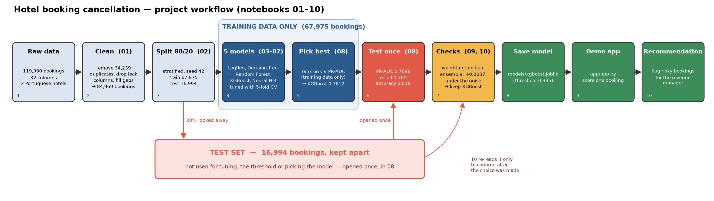
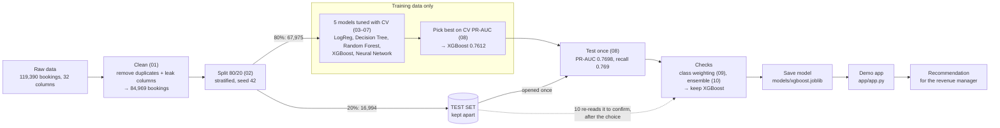

# Workflow diagram



The PNG is drawn by `scripts/make_workflow_diagram.py`:

```
.venv\Scripts\python scripts\make_workflow_diagram.py
```

## Text version (Mermaid)



## Step by step

| # | Step | Notebook / file | What happens | Key number |
| --- | --- | --- | --- | --- |
| 1 | Raw data | `data/raw/hotel_bookings.csv` | Two Portuguese hotels, arrivals July 2015 – Aug 2017. | 119,390 rows, 32 columns |
| 2 | Clean | `01_eda_cleaning` | Fill missing values, remove impossible rows, drop columns that are only known *after* booking (leaks), remove exact duplicate rows. Explore the data with charts. | 84,969 bookings left; cancel rate 37.1% → 27.7% |
| 3 | Split | `02_preprocessing` | 80% training, 20% test, stratified (same cancel rate in both), seed 42. The test set is saved and **not opened again** until step 6. | train 67,975 · test 16,994 |
| 4 | Five models | `03`–`07` | Logistic Regression, Decision Tree, Random Forest, XGBoost, Neural Network. Each one's settings are tuned with 5-fold cross-validation (CV) on the training set only, and each chooses its decision threshold from training data. | CV PR-AUC from 0.6470 to 0.7612 |
| 5 | Pick the best | `08_model_selection` | Rank the five by CV PR-AUC. Compare with a "no-skill" baseline that always guesses the cancel rate. | XGBoost 0.7612 (baseline 0.2775) |
| 6 | Test once | `08_model_selection` | Retrain XGBoost on all training rows, score the test set **one time**, with the threshold already fixed. | PR-AUC 0.7698, recall 0.7692, accuracy 0.8187 |
| 7 | Extra checks | `09_class_weighting`, `10_ensemble` | Would class weighting help? (No, on training folds.) Would averaging RF + XGBoost + NN help? (+0.0037, smaller than the 0.0080 noise; same result on test.) | XGBoost stays the final model |
| 8 | Save the model | `models/xgboost.joblib` | Every trained model is saved with joblib so it can score new bookings without retraining. | 3 MB file |
| 9 | Demo app | `app/app.py` | Streamlit app: enter one booking and get the probability and flag. `streamlit run app/app.py` | threshold 0.335 |
| 10 | Recommendation | [recommendation.md](recommendation.md) | What the hotel should do with the flags, and where the model is weak. | catches 77% of cancellations |

## Why the test set is drawn apart

The test set (red box) is split off in step 3 and is **not used to tune any model, choose the threshold or
pick the winner**. It is opened once, in notebook 08, after XGBoost and its threshold were already fixed.
That makes the test score an honest estimate: it landed at 0.7698, inside the CV estimate of
0.7612 ± 0.0090.

Notebook 10 reads the test set a second time (dashed arrow), but only to confirm a decision already
made on training data. We state this as a limitation in [recommendation.md](recommendation.md).

Decisions made at each step, with the options we considered, are in [decision_log.md](decision_log.md).
